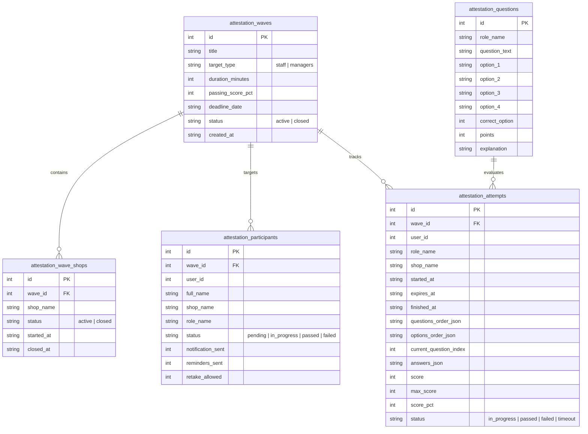

# Дизайн-специфікація: Нативна покрокова інлайн-атестація в Telegram-боті

**Дата:** 2026-09-12  
**Статус:** На узгодженні  
**Цільова гілка:** `main`

---

## 1. Загальний опис та мета

Метою є реалізація надійної, швидкої та зручної корпоративної атестації співробітників та керівників мережі пекарень BULKA безпосередньо у чаті Telegram-бота через нативні інлайн-кнопки (без використання сторонніх веб-додатків / Telegram Mini App).

### Ключові принципи
1. **Zero External Dependencies:** Відсутність потреби у веб-серверах, HTTPS-тунелях (ngrok/Cloudflare) та вразливостях кешування мобільних WebView iOS/Android.
2. **Single Dynamic Message UI:** Тест проходить в одному повідомленні бота, яке динамічно оновлюється при виборі варіантів відповіді (без спаму повідомленнями).
3. **Сервісний Toast-таймер:** При кожному натисканні кнопки (`callback_query`) Telegram показує спливаючий системний тост зверху екрана з точним залишком часу (`callback.answer("⏱ Залишилось: ХХ хв ХХ с", show_alert=False)`).
4. **Захист від списування:** Порядок варіантів відповідей для кожного працівника перемішується на початку тесту і фіксується в базі даних (якщо користувач натискає `[ ⬅️ Назад ]`, порядок варіантів зберігається, а раніше обрана відповідь відмічена `🔘`).
5. **Розділення сесій та гнучкість:** Окремі сесії для працівників пекарень та керівників. Можливість адміністратору підключати нові магазини до поточної сесії на льоту або зупиняти атестацію для конкретного магазину без закриття всієї хвилі.
6. **Збереження Excel-інфраструктури:** Завантаження питань через багатосторінковий шаблон `template_attestation.xlsx` (або `template_attestation_bulka.xlsx`) та експорт підсумкових звітів з аналітикою по пекарнях.

---

## 2. Архітектура та модель даних (`database/attestation.py`)

### 2.1. Таблиці бази даних



### 2.2. Поля збереження спроби (`attestation_attempts`)
Для реалізації надійної моделі **State-in-DB** (Підхід 1):
* `questions_order_json`: список ID запитань, наприклад `[14, 2, 7, 19, 3]`.
* `options_order_json`: словник випадкового порядку індексів варіантів `1..4` для кожного запитання, наприклад:
  `{"14": [3, 1, 4, 2], "2": [2, 4, 1, 3]}`.
  Це гарантує:
  1. Кожен користувач бачить свій унікальний порядок відповідей.
  2. При натисканні `[ ⬅️ Назад ]` порядок не стрибає і залишається незмінним.
* `answers_json`: збережені відповіді `{ "14": 3, "2": 2 }` (де зберігається оригінальний номер варіанта для коректного підрахунку балів).
* `current_question_index`: поточний індекс запитання (0..N-1).

---

## 3. Адміністративна панель та керування сесіями (`bot/menus/attestation.py`)

### 3.1. Майстер створення сесії
При створенні сесії адмін проходить 4 кроки:
1. **Цільова група:**
   - `[ 🥐 Працівники пекарень ]` — атестація барист, продавців тощо за пекарнями.
   - `[ 👔 Керівники ]` — спеціалізована управлінська атестація керуючих.
2. **Вибір учасників:**
   - Для працівників: мультиселект пекарень мережі (кнопки з галочками `[ 🔘 B-12 ]`, `[ ✅ B-19 ]` + `[ 🏁 Усі пекарні ]`).
   - Для керівників: мультиселект зі списку діючих керівників мережі.
3. **Параметри тесту:**
   - Час на проходження: 15, 20, 25, 30 хвилин.
   - Прохідний поріг: 70%, 75%, 80%, 85%, 90%.
4. **Підтвердження та авто-дедлайн:**
   - Дедлайн автоматично розраховується на 1 добу (до 23:59 наступного дня).
   - Кнопка `[ 🚀 Запустити атестацію ]` активує хвилю та ініціює безпечну похвильову розсилку запрошень.

### 3.2. Динамічне керування магазинами в активній сесії
В картці активної сесії для працівників відображається статус по кожному магазину:
```text
🎓 Активна атестація: Осінь 2026
Ціль: Працівники пекарень | Дедлайн: 13.09 23:59
Прогрес: 18/25 працівників склали (72%)

🏪 Пекарні у сесії:
🟢 B-12 вул. Чорновола — 8/10 склали (80%)
🟢 B-19 вул. Героїв Маріуполя — 2/5 склали (40%)
🔴 B-03 вул. Шевченка — Зупинено (8/10 склали)
```

**Доступні дії для адміна:**
1. `[ ➕ Запустити ще магазин ]` -> відкриває список непідключених магазинів. При обранні — магазин додається в сесію, створюються записи в `attestation_participants`, і працівники цього магазину одразу отримують запрошення в боті.
2. Клік по конкретній активній пекарні -> `[ ⏹ Зупинити для B-19 ]` -> статус магазину змінюється на `closed`. Працівники цієї пекарні, які ще не розпочали тест, більше не можуть його почати (отримують сповіщення "Атестацію для вашого магазину закрито").
3. `[ 📥 Завантажити Excel-звіт ]` -> генерує консолідований XLSX-файл з усіма поточними результатами (загальний лист + детальні листи по магазинах).
4. `[ 🏁 Завершити всю атестацію ]` -> закриває сесію повністю.

---

## 4. Інтерфейс проходження тесту співробітником

### 4.1. Етап 1: Запрошення та умови
Користувачеві приходить повідомлення:
```text
🥐 Корпоративна атестація BULKA
Назва: Піврічна атестація — Осінь 2026

⏱ Час на тест: 20 хвилин
🎯 Прохідний бал: 80%
📝 Кількість питань: 25

⚠️ Увага: надається 1 спроба. Таймер почнеться одразу після натискання кнопки «Почати атестацію»!

Готові перевірити свої професійні знання? 👇
```
Кнопка: `[ 🚀 Почати атестацію ]` (`callback_data="att_start_test"`)

### 4.2. Етап 2: Інтерактивне тестування (Single Message UI)
Повідомлення бота редагується:
```text
⏱ Час спливає о 13:35 (20 хв)
━━━━━━━━━━━━━━━━━━━━
❓ Питання 3 з 25:
Який термін реалізації свіжих круасанів з моменту випікання?
```

**Інлайн-клавіатура:**
```text
[ 6 годин ]
[ 12 годин ]
[ 24 години ]
[ До кінця зміни ]
[ ⬅️ Назад ]
```

#### Механіка переходів та відповіді:
1. Користувач тисне на один із варіантів (наприклад, `[ 12 годин ]`):
   - Відбувається виклик `callback.answer(f"⏱ Залишилось: {mins} хв {secs} с", show_alert=False)`. Зверху екрана на 2 секунди з'являється системний toast.
   - Відповідь зберігається в `attestation_attempts.answers_json`.
   - `current_question_index` збільшується на 1.
   - Повідомлення редагується на Питання 4 з новим текстом та його варіантами відповідей.
2. Якщо користувач тисне `[ ⬅️ Назад ]`:
   - `current_question_index` зменшується на 1.
   - Викликається toast з актуальним залишком часу.
   - Відкривається попереднє запитання. Раніше обраний варіант позначається радіо-кнопкою: `[ 🔘 12 годин ]`.
   - Внизу додається кнопка навігації `[ Далі ➡️ ]`, якщо користувач не бажає змінювати відповідь, або він може просто натиснути інший варіант.
3. Якщо час вичерпано під час проходження:
   - При будь-якому натисканні кнопки після `expires_at` бот фіксує статус `timeout`.
   - Виводиться фінальний результат за всіма збереженими відповідями.

### 4.3. Етап 3: Фінальний результат
Після відповіді на останнє запитання (або по тайм-ауту):
```text
🎉 Атестацію складено!
━━━━━━━━━━━━━━━━━━━━
👤 Співробітник: Іваненко Марія
🏪 Пекарня: B-12 вул. Чорновола
👔 Посада: Бариста

📊 Ваш результат: 22 з 25 балів (88%)
🎯 Прохідний поріг: 80%
⏱ Витрачено часу: 14 хв 12 с

Твій результат успішно зараховано до рейтингу пекарні! 🥐
```

Якщо бал менший за прохідний:
```text
⏳ Атестацію не складено
━━━━━━━━━━━━━━━━━━━━
📊 Результат: 16 з 25 балів (64%)
🎯 Прохідний поріг: 80%

Зверніться до свого керівника щодо призначення повторної спроби.
```

---

## 5. Робота з банком питань (`template_attestation.xlsx`)

* Питання завантажуються адміністратором через меню атестації за допомогою файлу Excel (`template_attestation.xlsx` / `template_attestation_bulka.xlsx`).
* Кожна вкладка відповідає посаді: `Бариста`, `Продавець`, `Керівник` тощо.
* Структура колонок:
  `Питання | Варіант 1 | Варіант 2 | Варіант 3 | Варіант 4 | Правильна відповідь (1-4) | Бали (1-5) | Пояснення`.
* При завантаженні Excel-файлу в бот:
  - Проводиться перевірка структури, кількості варіантів і коректності правильного варіанта.
  - Оновлюється таблиця `attestation_questions` у базі даних.
  - Повідомляється результат: *"✅ Успішно завантажено 25 питань для Бариста, 12 питань для Керівник"*.

---

## 6. Захист від збоїв та крайові випадки

1. **Перезапуск бота під час тесту:** Стан зберігається в SQLite (`attestation_attempts`). Працівник просто тисне на кнопку в повідомленні — бот зчитує спробу з БД і продовжує з того ж питання, на якому користувач зупинився, без зміни дедлайну.
2. **Дабл-кліки (швидке подвійне натискання):** У обробнику додається перевірка індексу питання — якщо відповідь на це питання вже обробляється, повторний клік ігнорується через `callback.answer()`.
3. **Спроба розпочати вдруге:** Кнопка «Почати атестацію» перевіряє статус спроби. Якщо спробу вже завершено, бот показує `callback.answer("Ви вже склали атестацію. Повторна спроба можлива лише з дозволу керівника.", show_alert=True)`.
4. **Магазин закрито адміністратором:** Якщо адмін натиснув «Зупинити для магазину», спроба не стартує: *"Атестацію для вашого магазину вже завершено"*.

---

## 7. План перевірки та тестування

1. **Юніт-тести (`tests/test_attestation_flow.py`):**
   - Тест створення сесії для працівників та для керівників.
   - Тест динамічного додавання магазину в активну сесію та зупинки магазину.
   - Тест старту спроби: перемішування варіантів, фіксація в JSON, збереження порядку при навігації `[ ⬅️ Назад ]`.
   - Тест підрахунку балів, перевірки дедлайну (timeout) та дозволу на перездачу (`allow_user_retake`).
2. **Ручне тестування в чаті бота:**
   - Проходження тесту з перевіркою спливаючого toast-таймера на мобільному пристрої.
   - Перевірка генерації підсумкового Excel-звіту для адміністратора.
